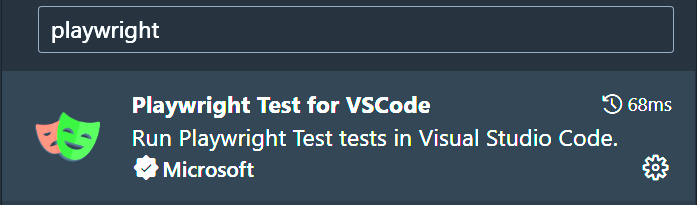

# Instructions

1. Abre tu bash favorito y crea una nueva carpeta

```powershell
$ mkdir [name]
$ cd [name]
$ code .
```

2. Inicia npm

```powershell
$ npm init -y
```

3. Instala la extensión de `Playwright`
   
4. **Instalar `Playwright`**

   - Pulsa `F1`
   - Busca `install playwright`
   - Selecciona los navegadores y si quieres que Playwright añada `GitHub Actions workflow`

     > En nuestro caso no lo añadimos ya que nuestro proyecto no está vinculado ni iniciado en `git`

   - Selecciona las opciones deseadas

# Tests

1. Abre la carpeta `tests` y su respectivo archivo y dale `play`
2. Si elegimo `Show browser` observamos cómo se abre el navegador yendo a la página testeada.

## Debugging

1. Cambiamos 'Get started' por `Star`
2. Marcamos e iniciamos en modo debug
3. Vemos en el navegador que hay varias identificaciones.
4. ¿Cómo lo arreglamos? &rarr; :arrow_right: ➡️ -> Locators

## Locators

1. Observamos cómo el test funciona
   - Vemos que si elegimos `Pick locator` te deja en el navegador ver qué selector sería el más indicado para cada sitio que queramos testear.

### Web First Assertions

[`Playwright Best Practices`](https://playwright.dev/docs/best-practices#:~:text=By%20using%20web%20first%20assertions%20Playwright%20will%20wait,toBeVisible%20%28%29%20will%20wait%20and%20retry%20if%20needed)

## Codegen

1. Cerramos el navegador actual
2. Elegimos `Record new`
3. Recorremos los pasos que queramos seguir en la web a testear
   > No se lleva bien con los hovers hasta donde he testeado

## Resultados

### Report

1. ```powershell
   $ npx playwright show-report
   ```

2. Pulsamos en el nombre del test y nos desglosará todos los pasos que hemos dado y si han funcionado correctamente.

### Trace Files

1. ```pwsh
   $ npx playwright test --trace on
   ```
2. Esto nos abrirá un nuevo report (si no volvemos al paso `1` de la sección `Report`) donde veremos todos los test en cada navegador.
3. Clicamos en alguno de los navegadores y podemos ver el **`TimeLaps`** o trazado de todo el testing realizado en cada navegador.

## Test en CI

Si conectaramos nuestro directorio con un repositorio de GitHub puedes lanzar `GitHub Actions` si lo instalamos con playwright.

[Muestra de GitHub Actions](https://github.com/debs-obrien/miduconftests/actions)

1. Pulsamos en `first commit`
2. Ahí normalmente nos saldría todo el `log` que muestra qué ha fallado.
3. Hay que tener en cuenta con los `retries`
4. Irán unidos a un report como `playwright-report` 
5. ```pwsh
   $ npx playwright show-report [nombre del report]
   ```

